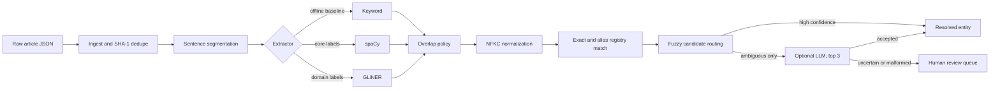

# Entity Resolution Pipeline

A complete, offset-preserving pipeline that ingests news JSON, finds mentions,
normalizes surface forms, resolves them across documents into a persistent entity
registry, routes ambiguous residue to an optional LLM, and evaluates extraction with
strict and relaxed metrics.

The repository includes a three-article fixture so the full system runs immediately.
The project brief does not contain the real 100-article corpus; replace `data/raw/`
with that corpus when it is supplied.

## Quick start

The deterministic default works with the Python standard library (Python 3.10+):

```powershell
python src/pipeline.py
python eval/score.py --pred data/output --gold data/gold --config keyword-baseline
python -m unittest discover -s tests -v
```

The generated artifacts are:

- `data/normalized/<doc_id>.json`: normalized, deduplicated inputs
- `data/output/<doc_id>.json`: validated pipeline results
- `data/output/review_queue.json`: cases deliberately left unresolved
- `registry/entities.json`: persistent aliases and canonical identities
- `eval/results/<timestamp>_<config>.json`: immutable experiment results

Running the pipeline a second time should report a cache hit rate of `1.0`, reproduce
the same documents, and leave the registry unchanged.

## Recommended environment

The project brief specifies Python 3.11 for model-backed runs:

```powershell
py -3.11 -m venv .venv
.venv\Scripts\Activate.ps1
python -m pip install --upgrade pip
pip install -r requirements.txt
python -m spacy download en_core_web_sm
python -m spacy download en_core_web_trf
```

GLiNER is optional because it downloads a large model stack:

```powershell
pip install gliner
```

## Architecture



Every sentence and mention uses document-level, start-inclusive/end-exclusive
offsets. Validation at each boundary enforces `text[start:end] == mention.text`.
Model imports are lazy, so offline mode does not require heavyweight packages.

## Running alternate extractors

```powershell
python src/pipeline.py --segmenter spacy --extractor spacy
python src/pipeline.py --segmenter spacy --extractor gliner
python src/pipeline.py --segmenter spacy --extractor merged
```

The merge policy gives spaCy ownership of `PERSON`, `ORG`, and `GPE`; GLiNER supplies
domain labels. Duplicate spans use source priority, while overlaps use the longest
span. Change models, labels, honorifics, suffixes, and thresholds in
`config/pipeline.json`.

To inspect the complete object between stages, add `--trace-stages`.

## LLM disambiguation

LLM calls are disabled by default and only receive cases scoring between the fuzzy
thresholds (or otherwise ambiguous), with at most three candidates and a valid
`none` option. Copy `.env.example` to `.env`, set a chat-completions-compatible full
endpoint URL, API key, and model, then run:

```powershell
python src/pipeline.py --enable-llm
```

Responses are schema-checked; prose, fenced JSON, missing fields, out-of-list entity
IDs, network errors, and exhausted retries fall back to the review queue without
crashing the run. Never commit `.env`.

## Supplying the real corpus

Each `data/raw/*.json` file may contain one article, an array of articles, or an
object with an `articles` array. Every article requires:

```json
{
  "url": "https://publisher.example/story",
  "title": "Story title",
  "published_at": "2026-03-14T09:00:00Z",
  "text": "Original article text, unchanged"
}
```

Raw files are never rewritten. `doc_id` is the SHA-1 of the URL. Duplicate URLs are
dropped deterministically.

## Evaluation and analysis

Gold annotations can be CSV or JSON. See `data/gold/GUIDELINES.md` before labeling
the first five real articles.

```powershell
python eval/score.py --pred data/output --gold data/gold --config spacy-sm
python eval/analyze_errors.py --pred data/output --gold data/gold
python eval/threshold_sweep.py --pred data/output --gold data/gold
python eval/benchmark_batching.py --model en_core_web_sm
```

`score.py` uses one-to-one matching and reports strict (exact span and label) and
relaxed (overlap and label) precision, recall, and F1 per label and overall.

See [experiment results](docs/RESULTS.md), [error-analysis procedure](docs/ERROR_ANALYSIS.md),
and [100,000-article scaling plan](docs/SCALING.md).

## Repository layout

```text
config/             normalization, model, label, and threshold policy
data/raw/           immutable article inputs
data/normalized/    deduplicated inputs (generated, gitignored)
data/gold/          annotation rules and gold mentions
data/output/        pipeline results and review queue (generated, gitignored)
registry/           canonical entity and alias registry
src/                all production stages and pipeline orchestration
eval/               scoring, error analysis, threshold sweep, benchmarks
eval/results/       timestamped experiment records (generated, gitignored)
tests/              unit and end-to-end idempotency tests
notebooks/          scratch work only; no production pipeline logic
docs/               results, error-analysis, and scaling write-ups
```

Deliberately out of scope: pronoun coreference, Wikidata linking, multilingual NER,
relation extraction, model fine-tuning, and a web UI.

